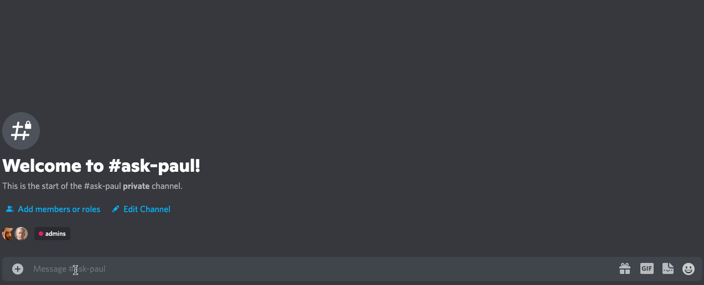

# This is Paul.


---
## Overview
Paul is a natural language chat-bot that can be found roaming the halls of the Turnbros Discord server.
Paul uses [Dialogflow](https://dialogflow.cloud.google.com) to understand you and [Temporal](https://temporal.io/) to coordinate the work he needs to do to help you.

### A glimpse into the inner workings of Paul


### This is how we interact with Paul


## Getting Started
**TODO: This is a litte out of date. Improve this.**
Environtment Variables
```
export K8S_NAMESPACE=temporal
export DISCORD_TOKEN=""
```

#### Label for game server
`gaming.turnbros.app/role=server`

#### Label for type of game server
`gaming.turnbros.app/type=satisfactory`
`gaming.turnbros.app/type=minecraft`
`gaming.turnbros.app/type=rust`
`gaming.turnbros.app/type=avorion`

## TODO
Here is what we still need to do to make Paul a real boy.

- Add security context settings to force the container to run as a non-root user/group and drop all capabilities.
- Tighten up Pauls Kubernetes permissions. We don't think Paul needs *that* much access.
- Implement the interfaces Paul will use to find and query his game servers.
- Teach Paul how to talk and help Paul understand how we're going to talk to him.
- Understand the scope of the second and third item so they can be broken down into actionable subtasks